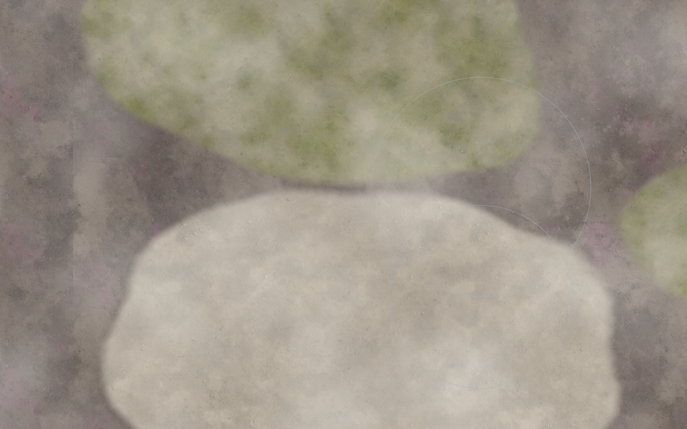
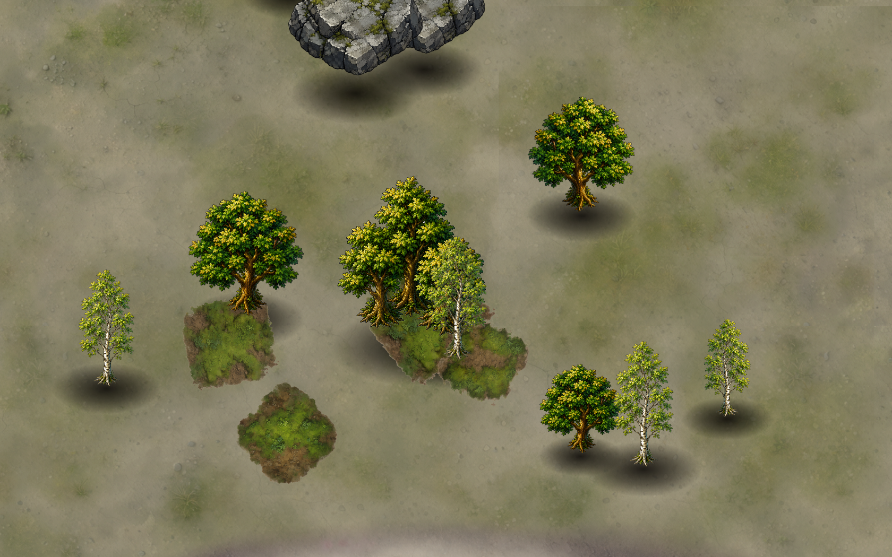
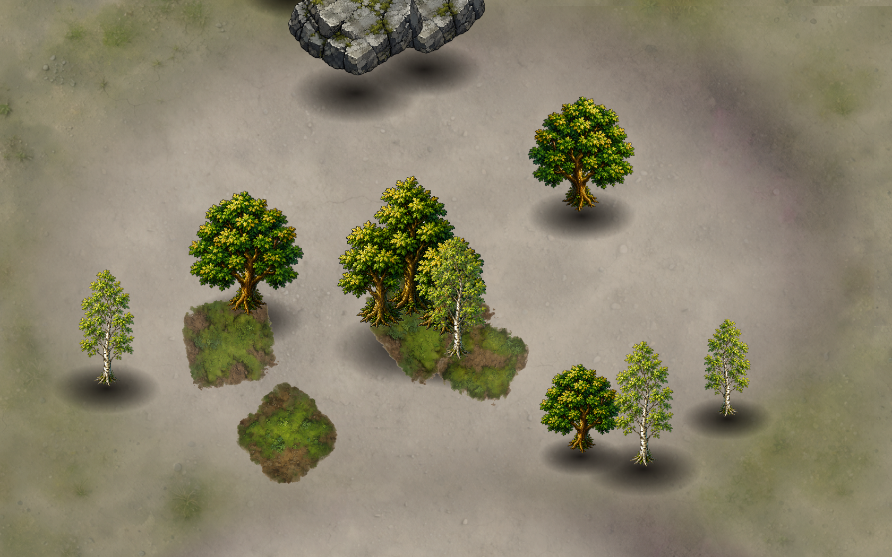
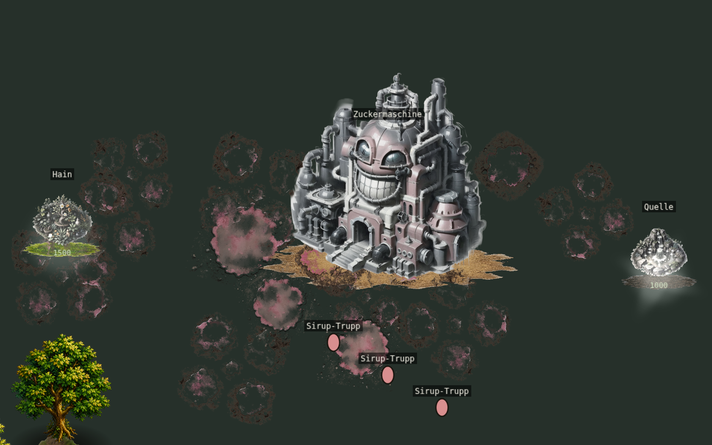
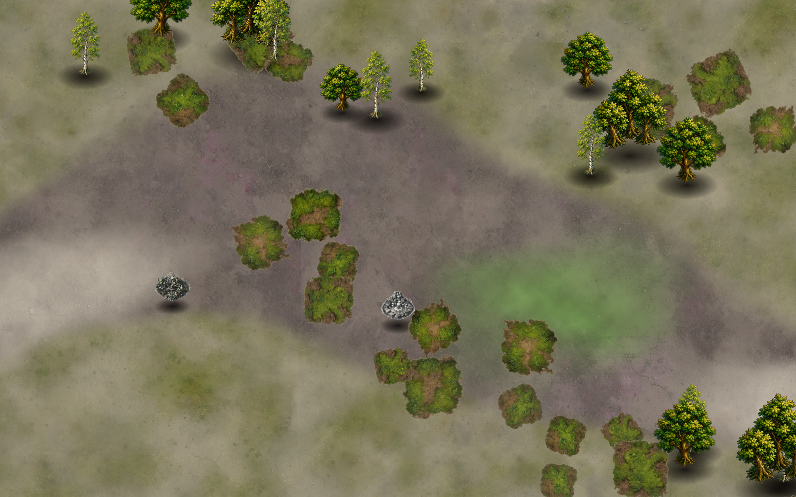

# HELLMUTH — Karteneditor & Splat-Terrain (Blueprint V3, Teil II)

In-Engine-Karteneditor plus das Splat-Terrain-Rendersystem darunter. Beides liegt
unter `src/editor/`. Das Spiel lädt jede Editor-Karte über DENSELBEN Renderer
(`?map=name`): was der Editor zeigt, ist das Spiel.

## Starten

- **Editor:** `?editor=1` (z. B. `npm run dev` → `http://localhost:5173/?editor=1`).
  Werkzeugleiste links, Welt rechts. Mausrad zoomt, mittlere/rechte Maustaste
  schwenkt, Pfeiltasten ebenso, `Strg+Z` macht rückgängig.
- **Karte spielen:** Knopf »Spielen« in der Leiste (lädt die aktuelle Karte über
  `?map=__session` in die Spielszene) oder direkt `?map=offen` / `?map=dicht`.
- **Headless-Prüfstand:** `PW_CHROME=<chrome> node tools/editor_browser.mjs <cmd>`
  - `gate offen dicht` — Mess-Gate, Exit 1 bei Befund
  - `editops` — Diff-Undo/Redo: ein Strich = ein Eintrag, undo/redo stellen exakt her
  - `roundtrip` — Speicher/Lade-Roundtrip: byte-gleich + tief-gleich + idempotent + Edge-Fälle
  - `rendereq` — Render-Gleichheit `Render(load(save))` pixelgleich (0 % Abweichung)
  - `shoot "?editor=1&map=offen" name [zoom cx cy]` — Canvas-PNG nach /tmp/edshots
  - `gameshot offen` — Spielszene lädt die Editor-Karte über denselben Renderer
  - `attack` — adversariale Zaun-Tests (diagonal/lückig/wackelnd) gegen den Detektor
  - `perf 96` — Perf/Cull bei großer Karte (FPS bei Pan, sichtbare/gesamte Chunks)
  - `terrainshots offen` — Captures fürs Python-Gate (terrain_*.png + objects_*.json + rt-Paar)
  - `author offen|dicht` — baut die Probekarte programmatisch mit den Editor-Werkzeugen

## Werkzeuge (`src/editor/editor_scene.ts` + `editor_ui.ts`)

| Werkzeug | Funktion |
|---|---|
| **Terrain-Pinsel** | Sorte wählen (Tote Erde / Sandlehm / Steppe), malen; Größe + Stärke. Ränder löst der Renderer automatisch. |
| **Decal-Streupinsel** | Moos / Sirup-Lache; Dichte-geregelte Streuung mit Auto-Variation (Variante, Rotation, Größe, Deckkraft, Spiegelung). |
| **Objekt-Platzierung** | Bäume / Felsen / Streu aus dem Bestand; Sub-Kachel-Jitter + Spiegelung + Skalen-Jitter + Tönung automatisch. Fehlende Assets → Platzhalter mit Kontakt. |
| **Vorkommen** | Hain / Quelle / Destillatsickerung. |
| **Startpunkte** | Spieler 1 (Hellmuth) / 2 (Moderat). |
| **Nebel** | Quellen setzen (Platzhalter-Layer; Partikeleffekt folgt, §12). |
| **Radierer / Undo / Speichern / Laden / Spielen** | Speicherformat ist versionierbarer Text (`*.hellmuth.json`); Laden ist **bit-identisch** zum Gespeicherten. |

## Terrain-Technik (`terrain_render.ts`, `terrain_assets.ts`, `noise.ts`)

Kein sichtbares Kacheln. Pro Sorte eine Grundebene; Oberebenen werden durch weiche
Deckungsmasken gestanzt (Canvas2D-Painter: vollflächig füllen → `destination-in`
Maske → `source-over` stapeln). Gerendert in 512-px-Chunks, inkrementell neu
komponiert beim Malen.

- **Organische Ränder:** Koordinaten-Domain-Warp im Welt-Pixel-Raum (nicht im
  Gitter — sonst scheint der Diamant durch), bewusst sub-Kachel und nicht-faltend
  (Auslenkung/Wellenlänge < 0,15), plus 3×3-Gewichtsglättung. Ergebnis: überall
  weiche, gefranste Übergänge, keine harte Kante, kein Rasterabdruck.
- **Anti-Wiederholung:** die vier Varianten je Sorte werden EINMAL beim Laden zu
  einer kachelbaren 2048er-„Schmelz"-Textur gemischt (periodisches Rauschen →
  nahtlos), dazu ein phasen-kontinuierlicher Ton-Jitter (Multiply) über die ganze
  Karte. Autokorrelations-Peak < 0,4.
- **Decals:** die Quell-PNGs sind Blatt-Texturen (mehrere Flecken auf Grund), NICHT
  freigestellt. Der Editor leitet daraus einmalig freigestellte, weich auslaufende
  Cutouts ab (anisotrope Rausch-Radialmaske, je Variante anderer Ausschnitt).
- **Bodenkontakt:** jedes Objekt bekommt einen weichen, randlosen Kontaktschatten
  (Radial-Gradient), kein heller Fundament-Teller. Nichts schwebt.

Das **Iso-Gesetz** bleibt unangetastet: `gridToScreen` aus `util/iso.ts`
(160×96, 36,87°) wird übernommen, das Tile-Raster ist das saubere Datenmodell,
die weiche Maske nur Erscheinung.

## Mess-Gate (`gate.ts`, `tools/editor_browser.mjs`)

Geprüft wird am gerenderten **Pixel** bzw. an der Platzierungs-Geometrie, nicht an
der Bounding-Box. Alle Probekarten sind grün.

1. **Kachelprobe** — jede der 12 Bodentexturen 3×3, Naht gegen Innen-Baseline. *Befund:* siehe Asset-Wunschliste.
2. **Harte Terrainkanten** — Sortengrenzen-Sampling; größte zusammenhängende harte Kante (Cluster) muss klein sein (Tripelpunkte erlaubt, Nähte nicht). Übergangsbreite im Fenster 8–115 px (≈ 0,75 Kachel, Recherche).
3. **Wiederholung** — Autokorrelation der Schmelz-Texturen < 0,62.
4. **Schwebende Objekte** — jedes Objekt mit Kontakt; 0 schwebend.
5. **Platzierungs-Geometrie** — Cluster + PCA: dünn-lange Linien (Zaun) werden
   erkannt, auch DIAGONAL, lückig oder leicht wackelnd; Haine/Felsbögen (in beide
   Achsen streuend) nicht. Plus Gitter-Anteil (Sub-Tile-Jitter erzwungen).
6. **Variation** — Decal-Skalenstreuung + Orientierungen; Doodad-Klonfeld-Detektor.
7. **Spielbar** — echte Engine-Pathfinding zwischen beiden Startpunkten.
8. **Roundtrip** — `serializeMap(loadMap(parse(s))) === s`, bit-identisch.

Der Detektor in (5) wurde gegen drei adversariale Zäune geprüft (`attack`): diagonal,
lückig, wackelnd — alle werden erkannt, die echten Karten bleiben sauber.

## Probekarten (mit dem Editor gebaut)

- **`offen`** — weite Sandlehm-Ebene, geschwungener Steppe-Marschweg als Geste,
  einzelne Haine unterschiedlicher Größe flankieren ihn, Felslandmarken, offene
  Lanes. Spiellogik: viel Bewegungsraum, umkämpfte Mitte mit neutralen Vorkommen,
  kurze Linien zwischen den Basen.
- **`dicht`** — zwei Waldmassive (dichter Kern, ausgefranster Rand) klammern eine
  zentrale Lichtung; ein unregelmäßiger Felsbogen bildet eine Engstelle mit
  Durchlass. Spiellogik: Sicht- und Bewegungskontrolle über die Lichtung, der
  Durchlass ist der natürliche Brennpunkt.

## Asset-Wunschliste (§12 — präzise benannt, von Ticro zu erstellen)

- **Bäume:** mehrere Arten, je mehrere ECHTE Varianten (eigene Sprites, nicht nur
  Spiegelung/Tönung). Aktuell tragen `baum-1/2/-tot`, `baumgruppe`, `wald` die
  Wälder; eine dritte/vierte Kronensilhouette bräche den Zwei-Stempel-Eindruck.
  KREA, gleicher Winkel/Perspektive wie die Gebäude. Einhängen = reiner Dateneintrag.
- **Freigestellte Decals:** die vorhandenen `bodendekor-*`-PNGs sind Blatt-Texturen
  auf undurchsichtigem Grund. Der Editor stellt sie per Maske frei (funktioniert),
  aber echte freigestellte Einzel-Decals (transparenter Hintergrund, 1 Motiv je
  Datei) sähen sauberer aus. Optional.
- **Nebel:** Silent-Hill-Bodenschwaden als Partikeleffekt (Werkzeug-Slot steht).
- **Wasser:** eigene Renderbehandlung nötig (animierter Shimmer + Reflexion), NICHT
  bloß eine weitere statische Texturebene. Erst wenn eine Karte es verlangt.
- **Fels:** zusätzliche Felsvarianten/Klippen-Tileset (Phase 2, §2.4) für echte
  Höhenkanten; aktuell tragen Felsnadel-/Felskanten-Doodads die Höhenwirkung.

## Kachelproben-Befund (Quell-Nähte, nur Ticro per Neugenerierung behebbar)

- **`boden-erde-tot-2.png`** — deutliche, sichtbare Kachelnaht (Naht/Innen-Verhältnis
  ≈ 11). Sollte neu generiert oder nahtlos nachbearbeitet werden.
- **`boden-steppe-1.png`** — leichte Naht (≈ 2,9), grenzwertig.
- Die übrigen 10 Bodentexturen sind nahtlos.

## Ehrliche Residuen

- Das Gate (5) erkennt Zäune ab ~4 Objekten und Lücken bis 3,5 Kacheln; ein
  extrem weit gestreuter Zaun (> 3,5 Kacheln Abstand) entginge dem Cluster, läse
  sich aber kaum noch als Zaun. PCA-Schwellen (Nebenachse ≤ 1,1) sind kalibriert,
  nicht bewiesen optimal.
- Doodad-Variation im Bild kommt aus Tönung/Spiegelung/Skalierung/Typ-Mix; echte
  Mehrfach-Varianten je Baumart fehlen noch (Wunschliste).
- Die Spielszene-Integration setzt je Startpunkt HQ + drei Arbeiter und überträgt
  Kollision/Vorkommen; volle Ökonomie-Verdrahtung editorbasierter Karten ist
  bewusst schlank gehalten (genug für den Spielbarkeits-Test).
- Übergangsbreite der gemalten Karten liegt um ~100 px (≈ 0,64 Kachel) — innerhalb
  des Recherche-Fensters, am oberen Rand; ein härterer Pinsel verschmälert sie bei
  Bedarf.

## Paket 1 — Datenformat & Decals (Solutions-Abgleich)

**Format v2 (`map_format.ts`).** Gewichte werden als Ganzzahl 0..255 gespeichert
(`WEIGHT_SCALE`, `quantizeWeight`), im Speicher als Float 0..1 — kein Float-Drift.
`saveMap` ist kanonisch (rekursiver Schlüssel-Sort RFC-8785-Prinzip, alle Listen
deterministisch sortiert, `groundTypes` bleibt unsortiert = w-Index). `loadMap`
ist eine **Normalform-Projektion**: migrieren (`migrate`, v1→v2), validieren,
klemmen, deduplizieren (Zelle/Wasser/Kollision), `w[]` auf `groundTypes.length`
zuschneiden, dequantisieren, alle Listen sortieren; unbekannte künftige Top-Level-
Keys landen verlustfrei in `meta.__unknown`. Beleg: `node tools/editor_browser.mjs
roundtrip` (byte+tief+idempotent, Edge-Fälle Float-Drift/Duplikat/OOB/NaN/Wasser)
und `rendereq` (pixelgleich). Quant. ist max-normiert (idempotent, der Renderer
normiert ohnehin über die Summe). `MapDoodad` trägt `rotation?`/`seed?`.

**Decals freigestellt (`terrain_assets.ts` → `buildDecalCutouts`).** Die Quell-PNGs
sind Blatt-Texturen ohne Alpha. Freistellung per **Distanz-Matte** (BG aus vier
48×48-Ecken, `alpha = clip((d−28)/42)`, KEIN Sättigungstor — das war der Moos-Bug).
Läuft live im Browser; die identische Offline-Variante steht in
`tools/process_decals.py` (braucht numpy/scipy/PIL). **Streuung per Poisson-Disk**
(inkrementelle Bridson-Variante, Mindestabstand dichteabhängig) statt Zufall —
kein Klumpen, kein Raster. Center-Origin, kein Schweben.

## Paket 2 — Bake-System (Solutions-Abgleich)

Der Boden wird gebacken, nicht pro Frame gemischt (`terrain_render.ts` = das
on-edit-Bake-Modul; Strang 1/2 waren bereits so gebaut, Strang 3/7 nachgezogen).

- **Strang 1+2 (Komposition + organische Masken):** geschichtete Sortenebenen,
  je Oberebene durch eine koordinaten-warp-gefranste Maske gestanzt; chunkweise
  (512 px) in CanvasTextures gebacken, on-edit nur die Chunks unterm Pinsel neu.
  Gate-verifiziert: keine harte Kante, kein Raster, Saum im Fenster.
- **Strang 3 (Anti-Wiederholung):** die früher periodische Schmelz-Textur
  (sichtbarer ~2048-px-Repeat, vom 2D-Autokorr-Gate belegt) ist ersetzt durch eine
  **weiche, welt-räumliche Varianten-Mischung** (zwei nicht-periodische fBm-Felder
  spannen die 4 Varianten je Sorte auf ~3-Kachel-Flecken auf, fließende Ränder)
  plus **Makro-Tönungs-fBm** (~30 Kacheln, inkommensurabel). Ergebnis: kein Tile-
  und kein Regionsperioden-Peak. **2D-Autokorrelation ist jetzt HARTES Gate**
  (`bild2D ≤ 0,5`; gemessen demo 0,0 / offen 0,35 / dicht 0,45; vorher dicht 0,72).
- **Strang 7 (Perf):** Chunking (512 px) + **worldView-Culling** (throttled, 1-Chunk-
  Marge) + variable Kartengröße (`computeRect` aus cols/rows). Beleg `perf 96`:
  ~59 FPS bei Pan, 48 von 540 Chunks sichtbar (91 % gecullt). Residuum: kein
  Speicher-Deckel (alle Chunk-Texturen materialisiert) — bis ~64×64 bequem, größere
  Karten bräuchten lazy Materialisierung ferner Chunks (siehe Residuen).

Bewusste Abweichungen von der Recherche: 512-px-Chunks statt 2048 (schnelle
On-Edit-Neukomposition < ein paar ms statt ~100 ms/Dab; Cull deckt die FPS,
Speicher-Deckel deckt die Skalierung); Value-/eigenes fBm statt OpenSimplex2 und
Painter-Stapelung statt Höhenfeld-Argmax am Tripelpunkt (Gate ist grün: keine
harte Kante, keine dunkle Naht). `map_texture.ts`-Slicer bleibt unangetastet
(wird nicht gebraucht, da pro Chunk direkt gebacken statt eine Überraum-Textur
geschnitten wird).

## Paket 3 — Editor-Bedienung (Solutions-Abgleich)

RTS-Bedienung über der Spiel-Kamera (`editor_scene.ts`):

- **Falloff-Pinsel mit Härte:** Regler Größe/Stärke/**Härte**. Härte-Plateau
  (`1 − smoothstep(r·hardness, r, dist)`): 1 = harter Kern bis zum Rand, 0 = weicher
  Verlauf ab Zentrum. Grenzen blenden zwangsläufig (Renderer fasert organisch).
- **Idiom:** Links = malen, **Rechts = löschen/abtragen** (Terrain: aktiven Typ
  abtragen; Decal/Objekt/Knoten: im Radius entfernen), Mitte = Pan, **Drag =
  Strich mit Zwischenpunkt-Interpolation** (kein Lückenstottern), **Shift = Linie**,
  **Strg = Pipette** (dominanten Bodentyp aufnehmen), **Alt = 3×3-Glätten**.
  Werkzeug-Schnellwahl **1/2/3 + Tab**. Maus verlässt den Canvas → Strich schließt
  sauber (`POINTER_UP_OUTSIDE`/`GAME_OUT`).
- **Diff-Undo + Redo (kein Snapshot):** `EditStroke` hält pro Strich nur die
  geänderten Zell-Gewichte (before/after) plus hinzugefügte/entfernte Decals/
  Objekte/Knoten und Spawn-Stände — **ein Undo-Eintrag pro Strich**, Tiefe 100,
  Redo wird bei neuem Edit geleert. Beleg `editops`: malen→1, undo→Ausgang,
  redo→1. Skaliert (kein O(Karte)/Schritt).
- **Vorschau-Kompositor:** *anders gelöst* — statt eines separaten Pro-Tile-
  Flachfarben-Previews zeigt der Editor live den ECHTEN Bake (nur die Chunks
  unterm Pinsel werden neu komponiert). Höhere Treue beim Malen; bei 36×36 flüssig.
  Bei sehr großen Karten + schnellem Zug wäre der billige Preview die Reserve
  (Residuum).
- **Normalisierung vor Speichern:** `saveMap` quantisiert/normiert intern
  (Paket 1) → Roundtrip bleibt bit-identisch, kein separater Schritt nötig.

## Paket 4 — Das Gate (Solutions-Abgleich)

Das Urteil fällt an **gerenderten Canvas-Pixeln, nie am Datenmodell** (der HUD-
Originalfehler). Zwei Formen:

- **Live-Gate (verifiziert, läuft headless):** `node tools/editor_browser.mjs gate`.
  Vier Pixel-Prüfungen nach Strang 8, plus die Zusatzprüfungen:
  1. **Uniform-Wächter** — der gerenderte Terrain-Canvas darf nicht uniform sein
     (sonst leer → falsch grün; die Kipp-Absicherung der Recherche).
  2. **Harte Kante** — Sobel-Grat auf dem RGB-Bild; längster gerader Hochgradienten-
     Lauf ≤ 26px (organische Ränder fransen, sind nicht lang+gerade). *Plus* der
     Coverage-Cluster-Check aus Paket 2.
  3. **Wiederholung** — 2D-Autokorrelation (H+V, Lokalmaximum) am gerenderten
     Bild, hart ≤ 0,5 (Strang 3↔8).
  4. **Schweben** — Fusspunkt jedes Objekts im VOLLEN Spiel-Canvas: liegt er über
     Editor-Leere (BG-Farbe), schwebt er; Randobjekte sind Residuum.
  5. **Roundtrip** — `editops`/`roundtrip` (Daten byte+tief+idempotent) und
     `rendereq` (Render pixelgleich, 0 %).
- **Offline-Gate (kanonisch, `tools/terrain_gate.py`):** strukturgleich zu
  `hud_gate.py`, dieselben vier `check_*` mit den Schwellwerten der Recherche
  (GRAD_HI=90, MIN_BLEND=12, MIN_RUN=64, T_REPEAT=0.45, FLOAT_GAP=6 …), Befunde mit
  Pixel-Koordinaten + markierten Crops, Exit 0 nur bei leerem Report. Speisung:
  `terrainshots` (Canvas BLEIBT, `?renderer=canvas` — sonst Leere fotografiert).
  **Benötigt numpy/scipy/PIL; im aktuellen Container nicht lauffähig** — das
  Live-Gate ist das verifizierte Äquivalent. Das Render-Roundtrip-Paar wurde als
  byte-identisch belegt.

## VFX Strang 1 — Welt-Nebel (`fog_render.ts`)

Silent-Hill-Dunst auf dem vorhandenen Substrat, **0 oder ~0 Zusatzspeicher**.

- **Technik:** zwei welt-getilte `TileSprite` über Boden/Decals, unter Einheiten
  (Tiefe −68000…−64000), gegenläufig driftend, masken-begrenzt auf die `fog`-Zonen
  via weich gebackener Deckungsmaske (`BitmapMask`, Welt→UV-Raster wie
  `map_texture.ts`). Schwaden-Textur ist **prozedural** (periodisches Plasma,
  nahtlos kachelnd) — kein KREA-Asset nötig.
- **Kein sichtbarer Loop:** Schwaden-Kachel ~10 Bodenkacheln (in einer Nebelzone
  < 1 Wiederholung) + zweite Schicht inkommensurabel (×1,37) + Drift → die
  2D-Autokorrelation des Gates findet **keinen** Perioden-Peak.
- **Lücken geschlossen:** `removeFog` + `EditStroke.addedFog/removedFog`
  (Undo/Redo) + Live-Vorschau (rebuild bei Setzen/Löschen/Undo). Editor UND Spiel
  verdrahtet (nur Editor-Karten).
- **Abnahme (`node tools/editor_browser.mjs fogtest` / `fogalpha`):**
  set/lösch/undo/redo OK; **Draw-Calls konstant `[2,2,2]` über 36/64/96**;
  **Gate grün mit gerendertem Nebel**; Alpha-Beitrag gemessen **mean 0,20 · p99
  0,54 ≤ 0,55** → Einheiten-Silhouette bleibt am Umriss erkennbar (Spitze gedeckelt,
  Nebel nie voll deckend).
- **Bewusst (noch) nicht:** lokale Partikel bei Dichte > 0,8 (flächenskalierend →
  bräche den >64×64-Deckel; kommt lokal/gekappt).

## VFX Strang 2 — Fließende Terrain-Texturwandlung (`terrain_transform.ts`)

Animiertes Splat-Gewicht in einem **nicht gespeicherten** Overlay
(`TerrainRenderer.delta`), KEIN Kachel-Swap. Pro Fraktionsgebäude ein wachsendes
Distanzfeld, das die Zielsorte anhebt; bei Abriss zurück. Gebacken in die
**bestehenden** Chunk-RTs → **0 zusätzliche RenderTexture, 0 MB**.

- **Fraktions-Zielsorten (zwei getrennte Ziele, `factionTargetSortId`):** MODERAT →
  `erde-tot` (korrumpiert, dunkel), HELLMUTH → `klarflur` (begrünt, lebendig) — eine
  **eigene** helle Sorte, NICHT sandlehm, damit die Umfärbung **immer** sichtbar ist
  (auf `offen` war sandlehm = Basis = unsichtbar). `klarflur` ist ein **prozeduraler
  Platzhalter** (gemotteltes Grün, nahtlos) bis Ticro die KREA-Bodentextur liefert —
  dann nur `procedural` entfernen und PNGs unter den `keys` ablegen. Der Renderer
  **hängt** fehlende `GROUND_SORTS` an seine Palette an (Basisgewicht 0) → die
  Wandlung greift auf **jeder** Karte, auch alten 3-Sorten-Karten, ohne Migration.
- **Abnahme (`factiontest`, `offen`):** Palette `[erde-tot, sandlehm, steppe,
  klarflur]`; MODERAT 1→0 (dunkelt), HELLMUTH 1→3 (begrünt), **beide sichtbar +
  distinkt**, `maxCluster=0` (weiches Band), Gate grün.

- **Weiche Kante statt Naht:** das anfängliche Basis-Canceln (`delta = −base`)
  machte den Dominanz-Sprung sub-Kachel hart — auf dem langen, sauberen Disc-Ring
  zählte das Gate eine 84-Sample-Naht. Fix: Zielsorte nur **anheben** (`TARGET`)
  und ein **breites, weiches Band** (`soft = max(0,75·r, 8)`) stehen lassen, das
  breiter als der Renderer-Warp ist → die gerenderte Deckung bleibt im Übergang.
  Sweep über Radius 5…11 belegt **maxCluster = 0** bei sichtbarer Umfärbung.
- **Abnahme (`node tools/editor_browser.mjs transformtest`):** Zentrum 1→2,
  außen unverändert, **Chunks 84→84 (0 MB)**, **Gate grün mitten in der Wandlung
  UND am Ende** (kein Kachelkanten-Sprung), reversibel bei Gebäude-Tod.
- **Spiel-Verdrahtung:** `GameState.onBuildingAdded/Removed` (darstellungsfrei) →
  der GameScene-Splat-Renderer setzt/zieht die Wandlung; Start-HQs färben gleich
  mit.

## VFX — Robustheit (Edge-Cases, `robusttest`)

Nebel + Wandlung gegen die Fälle gehärtet, die im Normaltest nicht auffallen — ein
gezielter Test je Fall, alle grün:

- **Karten-Wechsel/Reload:** `applyMap` zerstört Nebel + Wandlung und baut sie neu —
  keine Geister-Reste, kein Doppelaufbau (alte Masken-Textur entfernt).
- **Undo/Redo-Ketten:** Nebel setzen→löschen→undo→redo→undo, mehrfach, plus 30er-
  Undo-Schwanz → **kein RT-Leck** (die Maske wird **refresht**, nicht neu angelegt;
  texAfter == texMid), Endstand konsistent leer.
- **Viele überlappende Wandlungsquellen:** 8 nahe, gemischte Fraktionen → das Overlay
  wird je Tick als **Max-Komposit** aller Quellen neu gebaut (statt Last-Writer-Wins)
  → **kein Flackern** (zwei Folgekompositionen bit-gleich), Chunks 84→84 (**0 MB**),
  Gate grün.
- **Speicher-Roundtrip mit laufender Wandlung:** speichern→laden → das `delta` ist
  **nicht** mitpersistiert (`terrain` byte-gleich vor/nach der Wandlung), die Nebel-
  Daten kommen korrekt zurück.

## Gebaeude-Tool (DESTILLAT-SYSTEM)

Werkzeug »Gebaeude« in `editor_ui.ts` + `placeBuilding`/`removeBuilding` in
`editor_scene.ts`. Pflichtprobe `node tools/editor_browser.mjs destille_palette`.

- **Daten:** `MapBuilding {type,col,row,faction}` in `MapData.buildings[]`,
  vollstaendiger Roundtrip (loadMap normalisiert, ungueltige Fraktion droppt,
  OOB droppt, total-geordnet (col,row,type,faction); saveMap kanonisch dazwischen
  `decals` und `nodes`).
- **Katalog (`buildingCatalog(faction)`):** liest `buildings.json`+
  `baubar:true`, filtert nach Fraktion, schreibt `disabled`+`reason` bei
  Per-Fraktions-Cap (Destille 3, geteilt mit Code3 ueber `DESTILLE_MAX`/
  `DESTILLE_TIER` in `balance.ts` — **ein** Wahrheitsort).
- **`?testmode=1`** hebt die Sicht-Sperre auf (MODERAT sieht Destille). Die
  DATEN bleiben aber typ-treu: ein im testmode platziertes Gebaeude erhaelt
  IMMER `def.faction`, NICHT die Aufrufer-Fraktion. So kann MODERAT den
  HELLMUTH-Wirt-Check (`hasHellmuthDestille()`) nicht spoofen.
- **Spielwelt-Bruecke:** `populateFromMap` instantiiert `map.buildings` als
  `Building`-Entities (fertig=true). Owner wird aus dem ersten Spawn der
  passenden Fraktion abgeleitet; HQ-Typen werden uebersprungen (sie kommen
  aus dem Spawn). Code3's `destille_production` und `canConstruct` sehen sie
  damit automatisch.

## Grenze zur HUD-Instanz

`src/ui/html_hud.ts` und `src/ui/hud.css` wurden NICHT angefasst. Der Editor hat
eigene UI + eigenes CSS (`editor_ui.ts`, `editor.css`). Einziger geteilter Eingriff:
eine `?editor=1`-Abfrage am Kopf von `src/main.ts` (else-Zweig unverändert).
